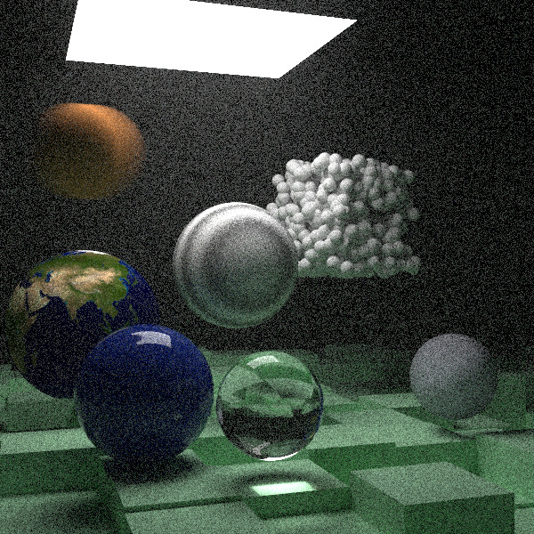

# Repo for all the code/notes I have for Graphics tutorials

Ray Tracing In One Weekend - Book 1 (rust)

Ray Tracing In One Weekend - Book 2 (rust - needs more documentation + creative render as photo)

Other planned ones:

learnopengl (which includes learning proper c++)-> book 3 (rust) -> vulkan (rust)-> I assume at this point I can latch onto something more

Notes:

Planned for the entirety of scratchapixel