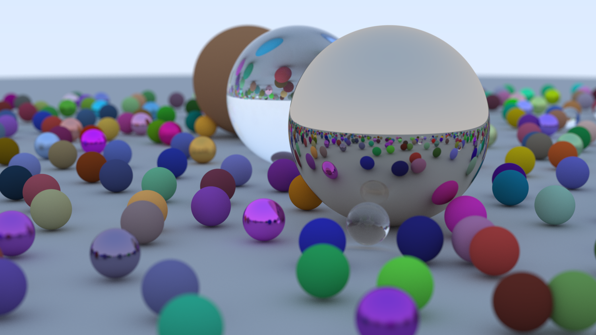
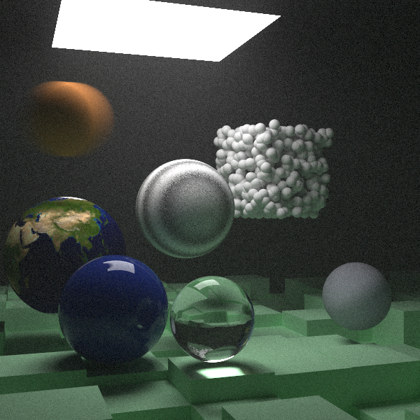

# Repo for all the code/notes I have for Graphics tutorials

Ray Tracing In One Weekend - Book 1 (rust)

  
Book1

 
---

Ray Tracing The Next Week - Book 2 (rust, better documented)

  
Book2

Credit: Porsche 911 with interior by [n.brizitskaya](https://sketchfab.com/3d-models/porsche-911-with-interior-877b1bc1739f4a2bb65d62fd7ffd9f75) licensed under CC BY 4.0

---

Other planned ones:

learnopengl (which includes learning proper c++) -> book 3 (rust) -> gpu tracing (full screen quad fragment shader, requires learning wgpu/webGPU?, wgsl) -> vulkan (rust) -> I assume at this point I can latch onto something more

Notes:

Planned for the entirety of scratchapixel