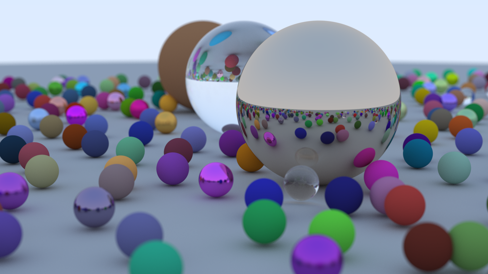
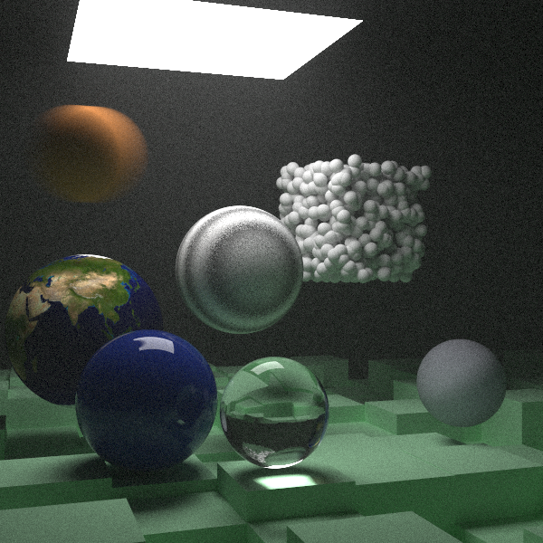
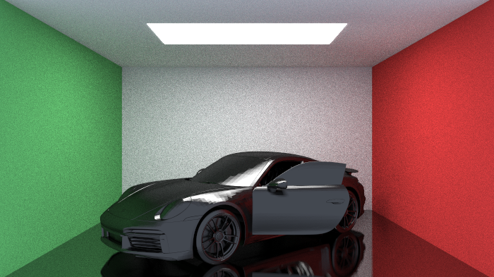

# Repo for all the code/notes I have for Graphics tutorials

Ray Tracing In One Weekend - Book 1 (rust)

  
Book1

 
---

Ray Tracing The Next Week - Book 2 (rust, better documented)

  
Book2

Credit: Porsche 911 with interior by [n.brizitskaya](https://sketchfab.com/3d-models/porsche-911-with-interior-877b1bc1739f4a2bb65d62fd7ffd9f75) licensed under CC BY 4.0

---

Ray Tracing The Next Week - Book 3 (rust)

  
Book3

List of issues in the book that are unresolved, without these some parts make no sense. I suggest looking over them:
https://github.com/RayTracing/raytracing.github.io/issues/1302
https://github.com/RayTracing/raytracing.github.io/issues/1553
https://github.com/RayTracing/raytracing.github.io/issues/1268
https://github.com/RayTracing/raytracing.github.io/issues/1703
https://github.com/RayTracing/raytracing.github.io/issues/1639
https://github.com/RayTracing/raytracing.github.io/issues/1642
https://github.com/RayTracing/raytracing.github.io/discussions/1735

Also this topic is very interesting, see these readings for more info than the book provides:
https://lisyarus.github.io/blog/posts/multiple-importance-sampling.html
https://pbr-book.org/4ed/Monte_Carlo_Integration/Monte_Carlo_Basics (2.1 - 2.1.3)
https://pbr-book.org/4ed/Monte_Carlo_Integration/Improving_Efficiency#StratifiedSampling (2.2 - 2.2.3)

---

TODO:
- ~~Book 1 (rust)~~
- ~~Book 2 (rust)~~
- learnopengl -> WIP ->
- ~~book 3 (rust) -> WIP -> Done~~ -> PBRTv4 
- gpu tracing (full screen quad fragment shader, requires learning wgpu/webGPU?, wgsl) -> WASM so cool on the web 
- vulkan (rust) -> I assume at this point I can latch onto something more

- Notes for the entirety of scratchapixel for how things work
- Somehow learn/relearn calc 1, 2, 3, linear algebra, Probability and stats, all sorts of math for graphics + machine/deep learning

